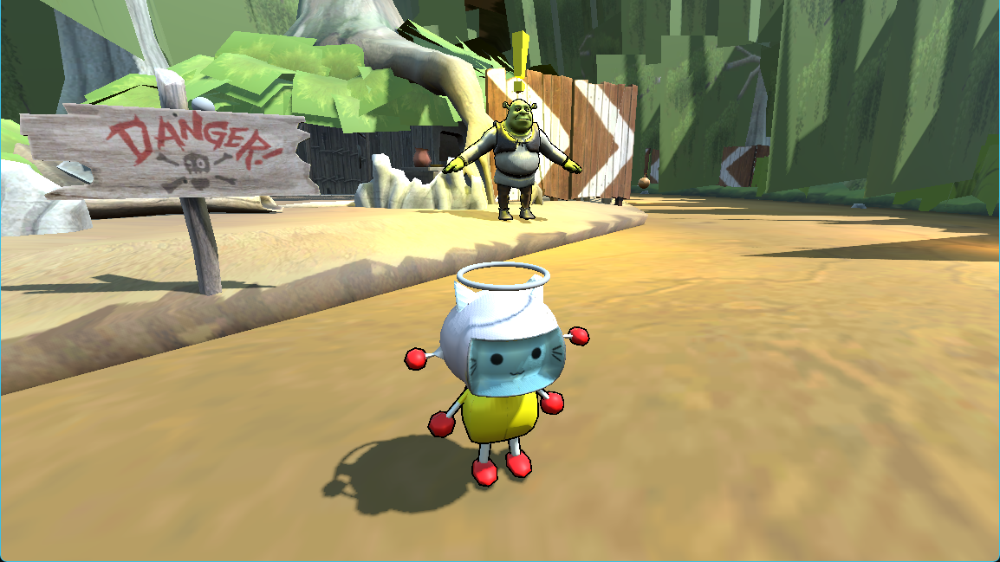
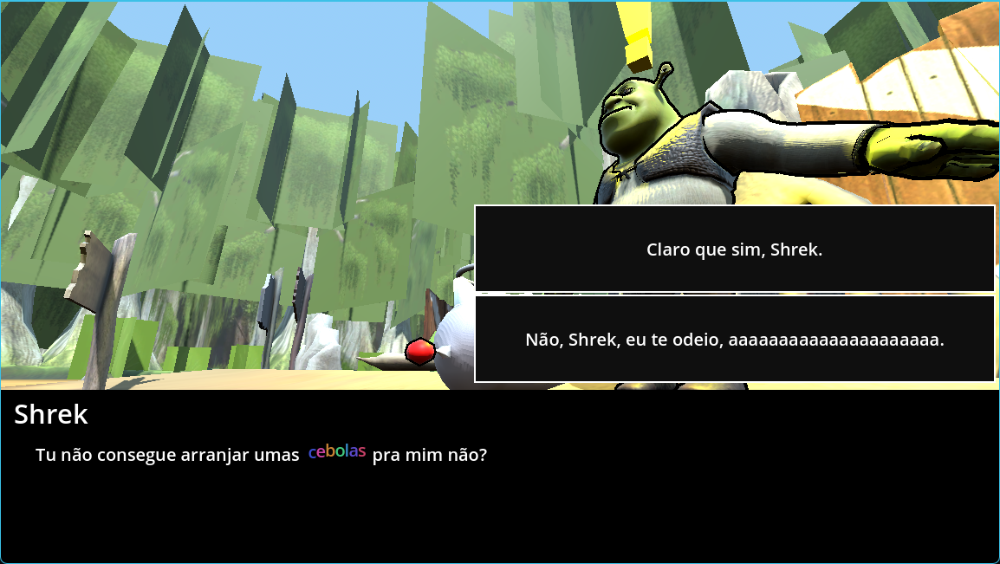

# Salve o Almoço do Shrek... Se você quiser // Save Shrek's Lunchtime... If you want

# Português

## Sobre
O jogo foi feito usando o Godot 4.5. Você pode dialogar com o Shrek, tendo várias opções para escolher, algumas das quais impactam o jogo.  
O jogo possui um shader de contorno, presente no Jogador e no Shrek.  
Os modelos do Jogador, da Porta, da Cebola e da Árvore foram feitos à mão para este projeto; os demais modelos foram encontrados na internet.

## Como Jogar
- Movimente-se usando as teclas "W; A; S; D".
- Você pode pular pressionando a "Barra de Espaço".
- Você pode interagir usando a tecla "E".

- Você pode avançar o diálogo pressionando "Botão Esquerdo do Mouse; Barra de Espaço; Enter; E".

## Jogabilidade
[(Vídeo)](https://drive.google.com/file/d/1VIPergtjDTlYeGSkahFDiV-CGW8ekF1d/view?usp=sharing)

# English

## About
The game mas made using Godot 4.5, you can dialog with Shrek, having multiple options to choose with some of thoses that impact in the game.  
The game has a shader of outline, present in the Player and Shrek.  
The model of the Player, the Door, the Onion and the Tree were handmade for this project, the others models were found in the internet.

## How to Play
- Move around using the keys "W; A; S; D".
- You can jump pressing the "Spacebar".
- You can interact using the key "E".
- You can advance the dialog by pressing "Left Mouse Button; Spacebar; Enter; E".

## Gameplay
[(Video)](https://drive.google.com/file/d/1VIPergtjDTlYeGSkahFDiV-CGW8ekF1d/view?usp=sharing)

